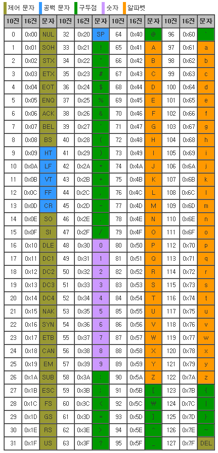

# TIL

## 리눅스 명령어

1. ls

   > list (목록표시)

2. cd
   change diretory (작업 경로 변경)

3. rm

   > remove (파일삭제)

4. mkdir  
   make directory(작업 목록 생성)

5. rmdir  
   remove directoty(작업 목록 삭제)

6. touch  
   파일생성

7. cat  
   파일의 내용 출력

## Git

1. init  
   git 생성
2. add <파일명>  
   staging area로 이동
3. commit -m <메세지>  
   Repossitory로 이동
4. push <원격저장소><브랜치>  
   원격(GitHub)으로 이동
5. pull <원격저장소><브랜치>  
   원격에서 로컬로 복사
6. clone <원격저장소><브랜치>  
   원격에서 로컬로 복제
7. status  
   Staging Area의 상태
8. log  
   repository의 상태
9. git commit --amend  
   바로 전 commit과 Staging Area의 합쳐서(Merge)을 할때 사용
10. git restore --staged <파일명>  
     Staging Area의 파일을 Working Directory로 가져옴

## 문자코드와 인코딩, 진법(진수) 정리

1. 문자코드

   - 문자와 숫자를 1:1로 매핑시켜 놓은 값이다.
   - 컴퓨터가 사용하는 0과 1로 변환할 때 사용되는 기준
     - ASCII코드(7비트), 확장 ASCII코드(= ANSI코드 : 8비트), 유니코드, EUC_KR코드
     - ASCII코드표

2. 인코딩

   - 문자 코드를 전산기기 안에서 0, 1로 저장하는 방식.
     - ASCII인코딩, 유니코드(utf-8, utf-16, utf-32), ECU-KR인코딩

3. 진법(진수)

   - code page : 각 나라별로 제공 (한국 : cp949)

   * 종류

     - 2진법 : 0과 1
     - 8진법 : 0 ~ 7
     - 10진법 : 0 ~ 9
     - 16진법 : 0 ~ 9 A(10) B(11) C(12) D(13) E(14) F(15)

   * 10진법에서 n진수로 변환하는 법

     - 10진수/n => n진수

   * Bit -> Byte
     - Bit : 0과 1만 표현
     - Byte : 8Bit 저장 가능

---

## HTML

1. vs code 셋팅 \*기본적으로 필요한 것들 설치(다만 너무 많이 설치 시 용량이 너무 커짐)

   - setting => quotes => javascript&typescript single&html로 변경
   - auto rename
   - html to css 검색 HTML to CSS completion 설치
   - css to html 검색 HTML CSS Support 설치

2. 웹은 Chrome이 좋다.

3. html 기본 사용 코드
   - ! Enter => 기본세팅
   - window키+ ; => 이모티콘
   - < head > 설정 및 제목 입력 < /head >
   - < body > 홈페이지 꾸미기 < /body >
   - title 페이지 창이름 /title
   - <!~~~~> => 주석
   - < h2 > 문서의 제목을 표시할 때 사용되는 요소이다.< /h2 >
   - < span >인라인의 대표적인 요소이다.< /span >
   - < div >블록의 대표적인 요소이다.< /div >
   - < style type="text/css">< /style > => 색 넣어주는 요소
   - < script >console.log("javascript");< /script > => 홈페이지 F12 console에서 확인가능
